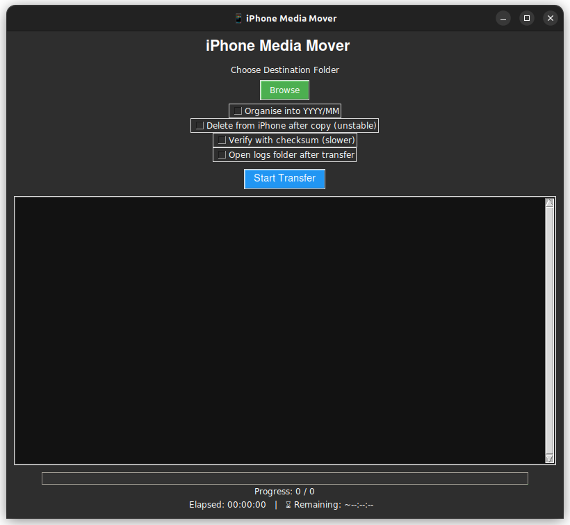
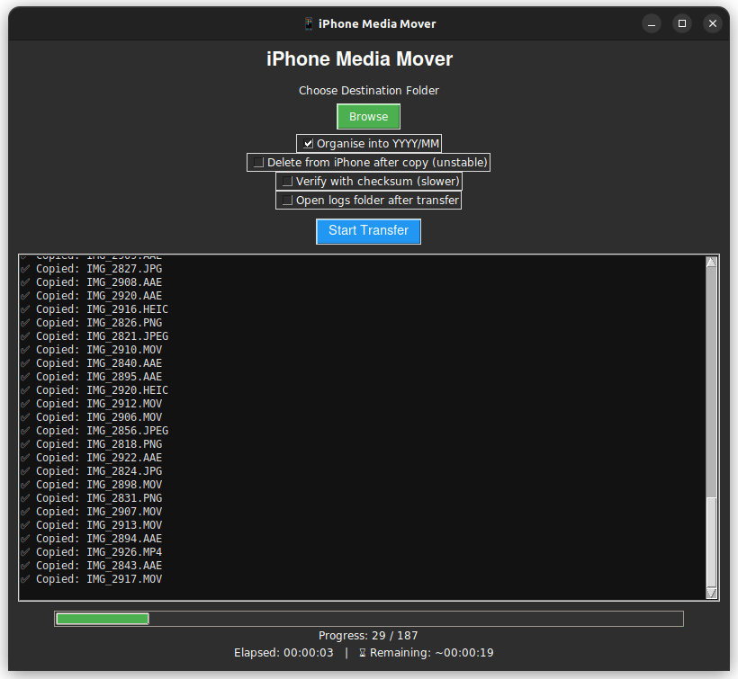
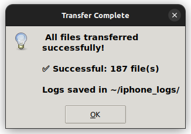

# iPhone Media Mover

A robust application to **safely copy, verify, and optionally delete photos and videos from an iPhone to Ubuntu**. Designed for reliability with clear logging, resumption support, and optional checksum validation.

## Features

* Copy → Verify → (Optional) Delete
* Automatically resumes after disconnection
* Organizes files by `YYYY/MM` (optional)
* Optional checksum (MD5) verification
* Progress bar using `tqdm`
* Detailed logs: `success.txt`, `failed.txt`, `deleted.txt`
* Compatible with recent versions of Ubuntu using `ifuse`



## System Setup (One-Time)

Install necessary packages and Python libraries:

```bash
sudo apt update
sudo apt install -y ifuse libimobiledevice6 libimobiledevice-utils gvfs-backends
pip3 install tqdm pillow piexif
```

## Save the Script

Save the script as `iphone_move.py`. Make it executable:

```bash
chmod +x iphone_move.py
```

## Usage

### 1. Copy and Organize into Folders by Year/Month

```bash
python3 iphone_move.py --dest ~/Pictures/iPhone --organise
```

### 2. Copy, Verify with Checksums, and Delete Originals from iPhone

```bash
python3 iphone_move.py --dest ~/Pictures/iPhone --organise --delete --checksum
```

### 3. Fast Flat Copy (No Organizing, No Deletion)

```bash
python3 iphone_move.py --dest ~/backup_iPhone
```



## Output Logs

Logs are saved in a `./iphone_logs/` directory:

* `success.txt` – Successfully copied and verified files
* `failed.txt` – Files that failed to copy or delete
* `deleted.txt` – Files deleted from the iPhone (only if `--delete` is used)



## Resuming Transfers

If disconnected or interrupted, simply rerun the same command. The script will **skip already verified files** and continue from where it left off.

## Checksum Option (`--checksum`)

* Compares MD5 hashes to ensure file integrity.
* Recommended when using `--delete` for extra safety.
* Slower but provides verification beyond file size.

## Options Reference

| Option | Description |
|--------|-------------|
| `--dest` | Destination directory on Ubuntu (required) |
| `--organise` | Organize files into `YYYY/MM` folders |
| `--delete` | Delete originals from iPhone after successful copy |
| `--checksum` | Use MD5 checksums to verify file integrity |
| `--mount` | Mount point (default: `~/iPhone`) |

## Example Directory Structure (with `--organise`)

```
~/Pictures/iPhone/
├── 2023/
│   ├── 11/
│   └── 12/
├── 2024/
│   ├── 01/
│   └── 06/
```

## Notes

* Make sure your iPhone is **unlocked and trusted** when connecting.
* Only files under the `DCIM` directory will be processed.
* The script automatically unmounts the iPhone at the end.

## License

MIT License – Free to use, modify, and distribute.
